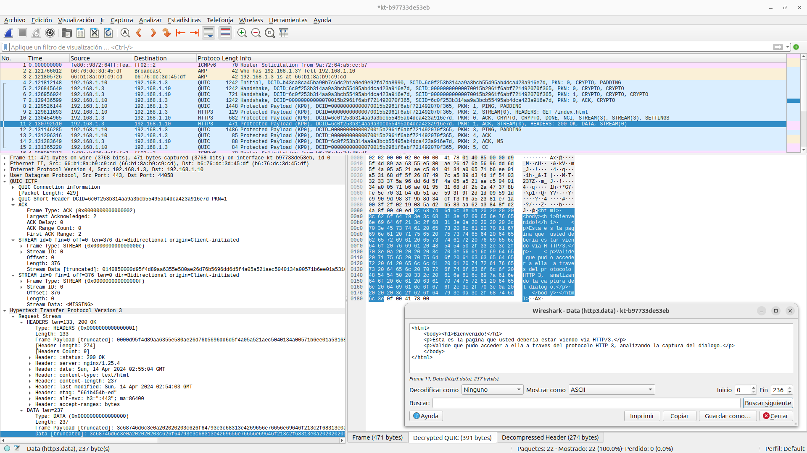
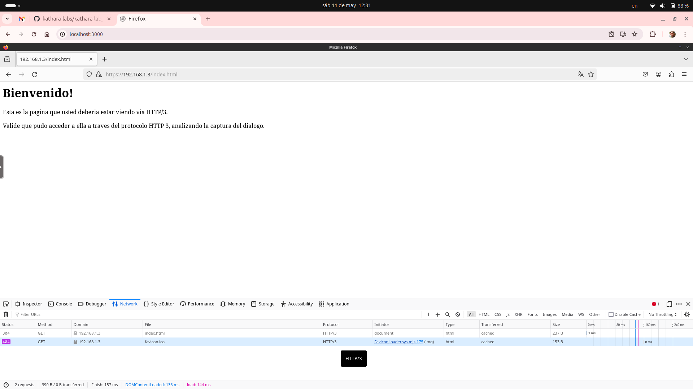

# HTTP/1.1, HTTP/2 and HTTP/3 Curl Basic Labs

1. Start the lab: `kathara lstart`
1. Open Wireshark and start capturing on the Kathara interface (named `kt-xxxx`) in the host machine.
1. Follow [this instructions](https://everything.curl.dev/usingcurl/tls/sslkeylogfile.html) to load in Wireshark the `sslkeys.log` from the `shared` directory. Curl will put all the TLS encryption keys negotiated in that place.

   Or, you can directly run Wireshark with this command: `sudo wireshark -o 'tls.keylog_file:./shared/sslkeys.log'` within the main laboratory directory, loading the curl encryption keys automatically.


   **Important Notes**:
     - Check if you need root permisions to capture on this network interface (ie., run Wireshark with `sudo`) and/or [check the Wireshark documentation](https://wiki.wireshark.org/CaptureSetup/CapturePrivileges).

     - You must use the old `bridge` network Kathara plugin, instead of the default `vde`. Run `sed -i "s/kathara\/katharanp_vde/kathara\/katharanp/g"  ~/.config/kathara.conf` to make the switch. More info: https://github.com/KatharaFramework/NetworkPlugin
   
     - Wireshark 4.2+ is required for QUIC+HTTP/3 parsing and decoding. Previous versions won't make it.

1. In the client terminal window:
 - Run the HTTP/1.1 example request:
```commandline
root@client:/# curl -v http://192.168.1.1/index.html
*   Trying 192.168.1.1:80...
* Connected to 192.168.1.1 (192.168.1.1) port 80 (#0)
> GET /index.html HTTP/1.1
> Host: 192.168.1.1
> User-Agent: curl/7.88.1
> Accept: */*
>
< HTTP/1.1 200 OK
< Date: Wed, 27 Mar 2024 21:11:50 GMT
< Server: Apache/2.4.57 (Debian)
< Last-Modified: Wed, 27 Mar 2024 21:08:53 GMT
< ETag: "f1-614aad05cc340"
< Accept-Ranges: bytes
< Content-Length: 241
< Vary: Accept-Encoding
< Content-Type: text/html
<
<html>
    <body><h1>Bienvenido!</h1>
    <p>Esta es la pagina que usted deberia estar viendo via HTTP/1.1.</p>
    <p>Valide que pudo acceder a ella a traves del protocolo HTTP 1.1, analizando la captura del dialogo.</p>
    </body>
* Connection #0 to host 192.168.1.1 left intact
```
 - Run the HTTP/2 example request:
```commandline
>root@client:/# curl -v http://192.168.1.2/index.html --http2
*   Trying 192.168.1.2:80...
* Connected to 192.168.1.2 (192.168.1.2) port 80 (#0)
> GET /index.html HTTP/1.1
> Host: 192.168.1.2
> User-Agent: curl/7.88.1
> Accept: */*
> Connection: Upgrade, HTTP2-Settings
> Upgrade: h2c
> HTTP2-Settings: AAMAAABkAAQCAAAAAAIAAAAA
>
< HTTP/1.1 101 Switching Protocols
< Upgrade: h2c
< Connection: Upgrade
* Received 101, Switching to HTTP/2
< HTTP/2 200
< last-modified: Wed, 27 Mar 2024 21:08:53 GMT
< etag: W/"ed-614aad05cc340"
< accept-ranges: bytes
< content-length: 237
< vary: Accept-Encoding
< content-type: text/html
< date: Sun, 00 Jan 1900 00:00:00 GMT
< server: Apache/2.4.57 (Debian)
<
<html>
    <body><h1>Bienvenido!</h1>
    <p>Esta es la pagina que usted deberia estar viendo via HTTP/2.</p>
    <p>Valide que pudo acceder a ella a traves del protocolo HTTP 2, analizando la captura del dialogo.</p>
    </body>
* Connection #0 to host 192.168.1.2 left intact
```
 - Run the HTTP/3 example request:
 ```commandline
 root@client:/# curl -v "https://http3.unlu.edu.ar/index.html" --cacert /etc/ssl/certs/nginx-selfsigned.crt --http3-only
* Host http3.unlu.edu.ar:443 was resolved.
* IPv6: (none)
* IPv4: 192.168.1.3
*   Trying 192.168.1.3:443...
* QUIC cipher selection: TLS_AES_128_GCM_SHA256:TLS_AES_256_GCM_SHA384:TLS_CHACHA20_POLY1305_SHA256:TLS_AES_128_CCM_SHA256
*  CAfile: /etc/ssl/certs/nginx-selfsigned.crt
*  CApath: /etc/ssl/certs
*  common name: http3.unlu.edu.ar (matched)
* Verified certificate just fine
* Connected to http3.unlu.edu.ar (192.168.1.3) port 443
* using HTTP/3
* [HTTP/3] [0] OPENED stream for https://http3.unlu.edu.ar/index.html
* [HTTP/3] [0] [:method: GET]
* [HTTP/3] [0] [:scheme: https]
* [HTTP/3] [0] [:authority: http3.unlu.edu.ar]
* [HTTP/3] [0] [:path: /index.html]
* [HTTP/3] [0] [user-agent: curl/8.7.2-DEV]
* [HTTP/3] [0] [accept: */*]
> GET /index.html HTTP/3
> Host: http3.unlu.edu.ar
> User-Agent: curl/8.7.2-DEV
> Accept: */*
> 
* Request completely sent off
< HTTP/3 200 
< server: nginx/1.25.4
< date: Sat, 13 Apr 2024 20:25:15 GMT
< content-type: text/html
< content-length: 237
< last-modified: Sat, 13 Apr 2024 20:03:45 GMT
< etag: "661ae521-ed"
< alt-svc: h3=":443"; ma=86400
< accept-ranges: bytes
< 
<html>
    <body><h1>Bienvenido!</h1>
    <p>Esta es la pagina que usted deberia estar viendo via HTTP/3.</p>
    <p>Valide que pudo acceder a ella a traves del protocolo HTTP 3, analizando la captura del dialogo.</p>
    </body>
* Connection #0 to host http3.unlu.edu.ar left intact
```

## Screenshot


## Using the Firefox Browser as client

There's a Firefox browser available in the network lab, ready to make requests to the three webservers. To access it, you have to open http://localhost:3000 in your host, for example:




**Note:** This feature works *as-is* with Linux hosts. If you're using Windows/Mac OS (with Docker Desktop), you have to comment the `browser[0]=A` line in the `lab.conf` file, and run this in the host console **after** the lab has started:

```commandline
kathara lconfig -n browser --add A
```
Then, configure the new eth interface in the `browser` container with something like 
`ip addr del 192.168.1.20/24 dev eth0 && ip addr add 192.168.1.20/24 dev eth1`. This is because of a docker-desktop bug. See https://github.com/KatharaFramework/Kathara/issues/230
